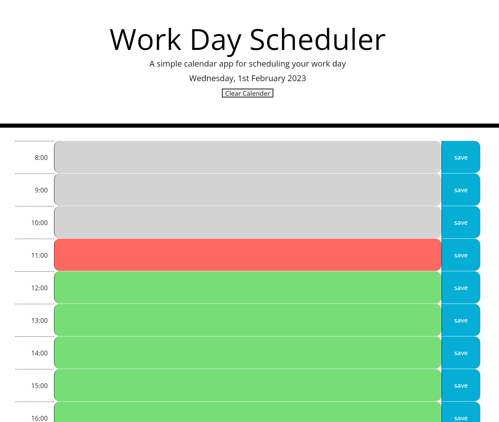

# CalenderApp-WC7

## Description

This project was made in response to the Trilogy Front End Bootcamp Weekly Challenge 7 - Calender application.

We were tasked with this user story

```md
AS AN employee with a busy schedule
I WANT to add important events to a daily planner
SO THAT I can manage my time effectively
```

and given some basic starter code. 

The requirements were as follows:

* Display the current day at the top of the calender when a user opens the planner.
 
* Present timeblocks for standard business hours when the user scrolls down.
 
* Color-code each timeblock based on past, present, and future when the timeblock is viewed.
 
* Allow a user to enter an event when they click a timeblock

* Save the event in local storage when the save button is clicked in that timeblock.

* Persist events between refreshes of a page


## Installation

No additional installation should be needed. The files were created in Visual Studio Code and consist of the basic website format - html, css, javascript, png.

## Usage

To be used by anyone who wants a simple daily planner.

To be used by Trilogy Education to asses how will I met the acceptance criteria.

To be used by anyone as a study guide - I tried to make copius notes to show my logic throught the creation of the script

Finally it was used by me as a great way to practice coding!




*calendar app open at 11am shoing the correct colour coding*

## Credits

Starter code provided by Trilogy education
Bootstrap was used to assist with the layouts
JQuery was used in the creation of script elements
Moment was used for the provision of the time and date elements
A font awesome link was included in the starter code but was not untilised.

## License

Please refer to the repo for the license information.


## Link to the live site 

https://ncstorey.github.io/CalenderApp-WC7/
